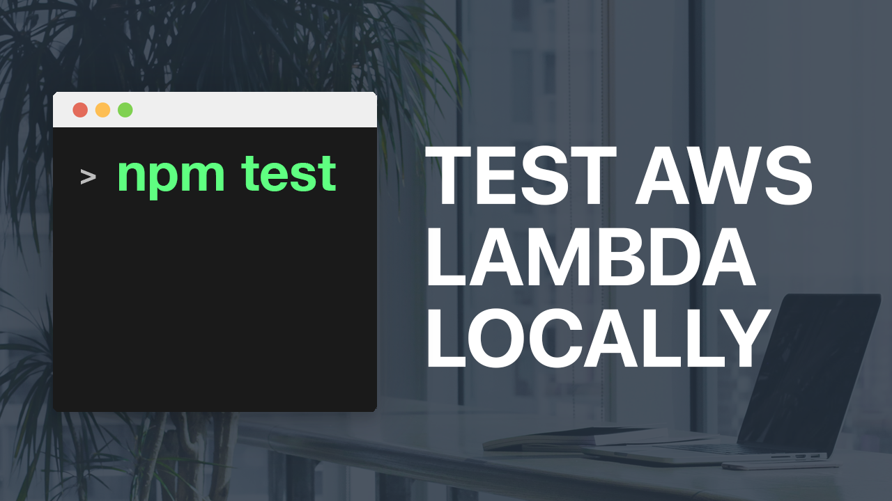

# Description

Source code for the screencast <a href="https://youtu.be/51EAwBDdgio" target="_blank">How to test and develop AWS lambda functions locally with nodejs?</a>

Don't forget to <a href="https://www.youtube.com/bitesizeacademy?sub_confirmation=1">subscribe</a>